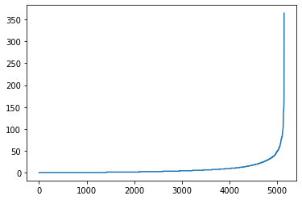

```python
import pandas as pd
import numpy as np
import matplotlib.pyplot as plt
import project_tests as t
import pickle

%matplotlib inline

df = pd.read_csv('data/user-item-interactions.csv')
df_content = pd.read_csv('data/articles_community.csv')
del df['Unnamed: 0']
del df_content['Unnamed: 0']

# Show df to get an idea of the data
df.head()
```
<table border="1" class="dataframe">
  <thead>
    <tr style="text-align: right;">
      <th></th>
      <th>article_id</th>
      <th>title</th>
      <th>email</th>
    </tr>
  </thead>
  <tbody>
    <tr>
      <td>0</td>
      <td>1430.0</td>
      <td>using pixiedust for fast, flexible, and easier...</td>
      <td>ef5f11f77ba020cd36e1105a00ab868bbdbf7fe7</td>
    </tr>
    <tr>
      <td>1</td>
      <td>1314.0</td>
      <td>healthcare python streaming application demo</td>
      <td>083cbdfa93c8444beaa4c5f5e0f5f9198e4f9e0b</td>
    </tr>
    <tr>
      <td>2</td>
      <td>1429.0</td>
      <td>use deep learning for image classification</td>
      <td>b96a4f2e92d8572034b1e9b28f9ac673765cd074</td>
    </tr>
    <tr>
      <td>3</td>
      <td>1338.0</td>
      <td>ml optimization using cognitive assistant</td>
      <td>06485706b34a5c9bf2a0ecdac41daf7e7654ceb7</td>
    </tr>
    <tr>
      <td>4</td>
      <td>1276.0</td>
      <td>deploy your python model as a restful api</td>
      <td>f01220c46fc92c6e6b161b1849de11faacd7ccb2</td>
    </tr>
  </tbody>
</table>
</div>


```python
import math
```


```python
math.log(1/4,2)
```


    -2.0


```python
math.pow(4,-1)
```


    0.25


```python
# Show df_content to get an idea of the data
df_content.head()
```

<table border="1" class="dataframe">
  <thead>
    <tr style="text-align: right;">
      <th></th>
      <th>doc_body</th>
      <th>doc_description</th>
      <th>doc_full_name</th>
      <th>doc_status</th>
      <th>article_id</th>
    </tr>
  </thead>
  <tbody>
    <tr>
      <td>0</td>
      <td>Skip navigation Sign in SearchLoading...\r\n\r...</td>
      <td>Detect bad readings in real time using Python ...</td>
      <td>Detect Malfunctioning IoT Sensors with Streami...</td>
      <td>Live</td>
      <td>0</td>
    </tr>
    <tr>
      <td>1</td>
      <td>No Free Hunch Navigation * kaggle.com\r\n\r\n ...</td>
      <td>See the forest, see the trees. Here lies the c...</td>
      <td>Communicating data science: A guide to present...</td>
      <td>Live</td>
      <td>1</td>
    </tr>
    <tr>
      <td>2</td>
      <td>☰ * Login\r\n * Sign Up\r\n\r\n * Learning Pat...</td>
      <td>Here’s this week’s news in Data Science and Bi...</td>
      <td>This Week in Data Science (April 18, 2017)</td>
      <td>Live</td>
      <td>2</td>
    </tr>
    <tr>
      <td>3</td>
      <td>DATALAYER: HIGH THROUGHPUT, LOW LATENCY AT SCA...</td>
      <td>Learn how distributed DBs solve the problem of...</td>
      <td>DataLayer Conference: Boost the performance of...</td>
      <td>Live</td>
      <td>3</td>
    </tr>
    <tr>
      <td>4</td>
      <td>Skip navigation Sign in SearchLoading...\r\n\r...</td>
      <td>This video demonstrates the power of IBM DataS...</td>
      <td>Analyze NY Restaurant data using Spark in DSX</td>
      <td>Live</td>
      <td>4</td>
    </tr>
  </tbody>
</table>
</div>


### <a class="anchor" id="Exploratory-Data-Analysis">第一部分：探索性数据分析</a>


```python
df.shape
```


    (45993, 3)


为了方便查看数据，为每个email创建独立的user_id列


```python
df.isnull().sum(axis = 0)
```


    article_id     0
    title          0
    email         17
    dtype: int64


```python
#为每个email创建对应的user_id
user_id = pd.DataFrame({'email':list(df[~df['email'].isnull()].email.unique()),'user_id':range(1,5149)})
```


```python
#添加id列到df
df = df.join(user_id.set_index('email'),on = 'email')
```

接下来查看数据的分布情况


```python
plt.plot(df.groupby('article_id').size().sort_values().reset_index()[0]);
# 大多数文章的互动用户数小于100
```


```python
df.groupby('article_id').size().quantile(q = 0.8)
# 近8成文章互动用户数小于89
```


    89.0


```python
df.groupby('article_id').size().mean()
# 平均互动用户数64.4
```


    64.41596638655462


```python
plt.plot(df.groupby('user_id').size().sort_values().reset_index()[0]);
# 从图中看来绝大多数用户的互动文章数小于25
```





```python
df.groupby('user_id').size().quantile(q = 0.9)
# 9成用户互动文章数小于22
```


    22.0


```python
# 每个id的平均文章互动数
df.groupby('article_id').size().mean()
```


    64.41596638655462


```python
# Fill in the median and maximum number of user_article interactios below
median_val = df.groupby('user_id').size().median()# 50% of individuals interact with ____ number of articles or fewer.
max_views_by_user = df.groupby('user_id').size().max() # The maximum number of user-article interactions by any 1 user is ______.
```

`2.` 发现并移除 **df_content** dataframe 中的重复文章。


```python
df_content.article_id.value_counts()
# 统计每个id出现次数，确实有id重复现象
```


    221    2
    232    2
    577    2
    398    2
    50     2
          ..
    695    1
    694    1
    693    1
    692    1
    0      1
    Name: article_id, Length: 1051, dtype: int64


id重复文章内容不一定重复，接下来对文章内容进一步确认，选取221号文章查看文章的内容


```python
df_content[df_content['article_id'] == 221].doc_body.iloc[1]
```


    'Homepage Follow Sign in / Sign up Homepage * Home\r\n * Data Science Experience\r\n * Data Catalog\r\n * \r\n * Watson Data Platform\r\n * \r\n\r\nSusanna Tai Blocked Unblock Follow Following Offering Manager, Watson Data Platform | Data Catalog Oct 30\r\n--------------------------------------------------------------------------------\r\n\r\nHOW SMART CATALOGS CAN TURN THE BIG DATA FLOOD INTO AN OCEAN OF OPPORTUNITY\r\nOne of the earliest documented catalogs was compiled at the great library of\r\nAlexandria in the third century BC, to help scholars manage, understand and\r\naccess its vast collection of literature. While that cataloging process\r\nrepresented a massive undertaking for the Alexandrian librarians, it pales in\r\ncomparison to the task of wrangling the volume and variety of data that modern\r\norganizations generate.\r\n\r\nNowadays, data is often described as an organization’s most valuable asset, but\r\nunless users can easily sift through data artifacts to find the information they\r\nneed, the value of that data may remain unrealized. Catalogs can solve this\r\nproblem by providing an indexed set of information about the organization’s\r\ndata, storing metadata that describes all assets and providing a reference to\r\nwhere they can be found or accessed.\r\n\r\nIt’s not just the size and complexity of the data that makes cataloging a tough\r\nchallenge: organizations also need to be able to perform increasingly\r\ncomplicated operations on that data at high speed, and even in real-time. As a\r\nresult, technology leaders must continually find better ways to solve today’s\r\nversion of the same cataloging challenges faced in Alexandria all those years\r\nago.\r\n\r\nENTER IBM\r\nIBM’s aim with Watson Data Platform is to make data accessible for anyone who uses it. An integral part of Watson\r\nData Platform will be a new intelligent asset catalog, IBM Data Catalog , a solution underpinned by a central repository of metadata describing all the\r\ninformation managed by the platform. Unlike many other catalog solutions on the\r\nmarket, the intelligent asset catalog will also offer full end-to-end\r\ncapabilities around data lifecycle and governance.\r\n\r\nBecause all the elements of Watson Data Platform can utilize the same catalog,\r\nusers will be able to share data with their colleagues more easily, regardless\r\nof what the data is, where it is stored, or how they intend to use it. In this\r\nway, the intelligent asset catalog will unlock the value held within that data\r\nacross user groups — helping organizations use this key asset to its full\r\npotential.\r\n\r\nBREAKING DOWN SILOS\r\nWith Watson Data Platform, data engineers, data scientists and other knowledge\r\nworkers throughout an enterprise can search for, share and leverage assets\r\n(including datasets, files, connections, notebooks, data flows, models and\r\nmore). Assets can be accessed using the Data Science Experience web user interface to analyze data,\r\n\r\nTo collaborate with colleagues, users can put assets into a Project that acts as\r\na shared sandbox where the whole team can access and utilize them. Once their\r\nwork is complete, they can submit any resulting content to the catalog for\r\nfurther reuse by other people and groups across the organization.\r\n\r\nRich metadata about each asset makes it easy for knowledge workers to find and\r\naccess relevant resources. Along with data files, the catalog can also include\r\nconnections to databases and other data sources, both on- and off-premises,\r\ngiving users a full 360-degree view to all information relevant to their\r\nbusiness, regardless of where or how it is stored.\r\n\r\nMANAGING DATA OVER TIME\r\nIt’s important to look at data as an evolving asset, rather than something that\r\nstays fixed over time. To help manage and trace this evolution, IBM Data Catalog\r\nwill keep a complete track of which users have added or modified each asset, so\r\nthat it is always clear who is responsible for any changes.\r\n\r\nSMART CATALOG CAPABILITIES FOR BIG DATA MANAGEMENT\r\nThe concept of catalogs may be simple, but when they’re being used to make sense\r\nof huge amounts of constantly changing data, smart capabilities make all the\r\ndifference. Here are some of the key smart catalog functionalities that we see\r\nas integral to tackling the big data challenge.\r\n\r\nDATA AND ASSET TYPE AWARENESS\r\nWhen a user chooses to preview or view an asset of a particular type, the data\r\nand asset type awareness feature will automatically launch the data in the best\r\nviewer — such as a shaper for a dataset, or a canvas for a data flow. This will\r\nsave time and boost productivity for users, optimizing discovery and making it\r\neasier to work with a variety of data types without switching tools.\r\n\r\nINTELLIGENT SEARCH AND EXPLORATION\r\nBy combining metadata, machine learning-based algorithms and user interaction\r\ndata, it is possible to fine-tune search results over time. Presenting users\r\nwith the most relevant data for their purpose will increase usefulness of the\r\nsolution the more it is used.\r\n\r\nSOCIAL CURATION\r\nEffective use of data throughout your organization is a two-way street: when\r\nusers discover a useful dataset, it’s important for them to help others find it\r\ntoo. Users can be encouraged to engage by taking advantage of curation features,\r\nenabling them to tag, rank and comment on assets within the catalog. By\r\naugmenting the metadata for each asset, this can help the catalog’s intelligent\r\nsearch algorithms guide users to the assets that are most relevant to their\r\nneeds.\r\n\r\nDATA LINEAGE\r\nIf data is incomplete or inaccurate, utilizing it can cause more problems than\r\nit solves. On the other hand, if data is accurate but users do not trust it,\r\nthey might not use it when it could make a real difference. In either scenario,\r\ndata lineage can help.\r\n\r\nData lineage captures the complete history of an asset in the catalog: from its\r\noriginal source, through all the operations and transformations it has\r\nundergone, to its current state. By exploring this lineage, users can be\r\nconfident they know where assets have come from, how those assets have evolved,\r\nand whether they can be trusted.\r\n\r\nMONITORING\r\nTaking a step back to a higher-level view, monitoring features will help users\r\nkeep track of overall usage of the catalog. Real-time dashboards help chief data\r\nofficers and other data professionals monitor how data is being used, and\r\nidentify ways to increase its usage in different areas of the organization.\r\n\r\nMETADATA DISCOVERY\r\nWe have already mentioned that data needs to be seen as an evolving asset —\r\nwhich means our catalogs must evolve with it. We plan to make it easy for users\r\nto augment assets with metadata manually; in the future, it may also be possible\r\nto integrate algorithms that can discover assets and capture their metadata\r\nautomatically.\r\n\r\nDATA GOVERNANCE\r\nFor many organizations, keeping data secure while ensuring access for authorized\r\nusers is one of the most significant information management challenges. You can\r\nmitigate this challenge with rule-based access control and automatic enforcement\r\nof data governance policies.\r\n\r\nAPIS\r\nFinally, the catalog will enable access to all these capabilities and more\r\nthrough a set of well-defined, RESTful APIs. IBM is committed to offering\r\napplication developers easy access to additional components of Watson Data Platform , such as persistence stores and data sets. We hope that they can use our\r\nservices to extend their current suite of data and analytics tools, to innovate\r\nand create smart new ways of working with the data.\r\n\r\nLearn more about IBM Data Catalog\r\n\r\n\r\n--------------------------------------------------------------------------------\r\n\r\nWritten by Jay Limburn\r\nDistinguished Engineer and Offering Lead, Watson Data Platform\r\n\r\nOriginally published at www.ibm.com on August 1, 2017\r\n\r\n * Data Catalog\r\n * Data Management\r\n * Data Analytics\r\n * IBM\r\n * Ibm Watson\r\n\r\nA single golf clap? Or a long standing ovation?By clapping more or less, you can signal to us which stories really stand out.\r\n\r\nBlocked Unblock Follow FollowingSUSANNA TAI\r\nOffering Manager, Watson Data Platform | Data Catalog\r\n\r\nFollowIBM WATSON DATA PLATFORM\r\nBuild smarter applications and quickly visualize, share, and gain insights\r\n\r\n * \r\n * \r\n * \r\n * \r\n\r\nNever miss a story from IBM Watson Data Platform , when you sign up for Medium. Learn more Never miss a story from IBM Watson Data Platform Get updates Get updates'


```python
df_content[df_content['article_id'] == 221].doc_body.iloc[0]
```


    "* United States\r\n\r\nIBM® * Site map\r\n\r\nSearch within Bluemix Blog Bluemix Blog * About Bluemix * What is Bluemix\r\n    * Getting Started\r\n    * Case Studies\r\n    * Hybrid Architecture\r\n    * Open Source\r\n    * Trust, Security, Privacy\r\n    * Data Centers\r\n    * Our Network\r\n    * Automation\r\n    * Architecture Center\r\n   \r\n   \r\n * Products * Compute Infrastructure\r\n    * Compute Services\r\n    * Hybrid Deployments\r\n    * Watson\r\n    * Internet of Things\r\n    * Mobile\r\n    * DevOps\r\n    * Data Analytics\r\n    * Network\r\n    * Open Source\r\n    * Storage\r\n    * Security\r\n   \r\n   \r\n * Services * Bluemix Services\r\n    * Garage\r\n   \r\n   \r\n * Pricing\r\n * Support * Support\r\n    * Contact Us\r\n    * Resources\r\n    * Docs\r\n   \r\n   \r\n * Blog * How-tos\r\n    * Trending\r\n    * What's New\r\n    * Events\r\n   \r\n   \r\n * Partners * Partners\r\n    * Become a Partner\r\n    * Find a Partner\r\n   \r\n   \r\n * Sign up\r\n\r\nDATA ANALYTICSHOW SMART CATALOGS CAN TURN THE BIG DATA FLOOD INTO AN OCEAN OF OPPORTUNITY\r\nAugust 1, 2017 | Written by: Jay Limburn\r\n\r\nCategorized: Data Analytics\r\n\r\nShare this post:\r\n\r\n\r\n\r\n\r\n\r\nOne of the earliest documented catalogs was compiled at the great library of\r\nAlexandria in the third century BC, to help scholars manage, understand and\r\naccess its vast collection of literature. While that cataloging process\r\nrepresented a massive undertaking for the Alexandrian librarians, it pales in\r\ncomparison to the task of wrangling the volume and variety of data that modern\r\norganizations generate.\r\n\r\nNowadays, data is often described as an organization’s most valuable asset, but\r\nunless users can easily sift through data artifacts to find the information they\r\nneed, the value of that data may remain unrealized. Catalogs can solve this\r\nproblem by providing an indexed set of information about the organization’s\r\ndata, storing metadata that describes all assets and providing a reference to\r\nwhere they can be found or accessed.\r\n\r\nIt’s not just the size and complexity of the data that makes cataloging a tough\r\nchallenge: organizations also need to be able to perform increasingly\r\ncomplicated operations on that data at high speed, and even in real-time. As a\r\nresult, technology leaders must continually find better ways to solve today’s\r\nversion of the same cataloging challenges faced in Alexandria all those years\r\nago.\r\n\r\n\r\n\r\nENTER IBM\r\nIBM’s aim with Watson Data Platform is to make data accessible for anyone who uses it. An integral part of Watson\r\nData Platform will be a new intelligent asset catalog, IBM Data Manager, a\r\nsolution underpinned by a central repository of metadata describing all the\r\ninformation managed by the platform. Unlike many other catalog solutions on the\r\nmarket, the intelligent asset catalog will also offer full end-to-end\r\ncapabilities around data lifecycle and governance.\r\n\r\nBecause all the elements of Watson Data Platform can utilize the same catalog,\r\nusers will be able to share data with their colleagues more easily, regardless\r\nof what the data is, where it is stored, or how they intend to use it. In this\r\nway, the intelligent asset catalog will unlock the value held within that data\r\nacross user groups—helping organizations use this key asset to its full\r\npotential.\r\n\r\n\r\n\r\nBREAKING DOWN SILOS\r\nWith Watson Data Platform, data engineers, data scientists and other knowledge\r\nworkers throughout an enterprise can search for, share and leverage assets\r\n(including datasets, files, connections, notebooks, data flows, models and\r\nmore). Assets can be accessed using the Data Science Experience web user interface to analyze data,\r\n\r\nTo collaborate with colleagues, users can put assets into a Project that acts as\r\na shared sandbox where the whole team can access and utilize them. Once their\r\nwork is complete, they can submit any resulting content to the catalog for\r\nfurther reuse by other people and groups across the organization.\r\n\r\nRich metadata about each asset makes it easy for knowledge workers to find and\r\naccess relevant resources. Along with data files, the catalog can also include\r\nconnections to databases and other data sources, both on- and off-premises,\r\ngiving users a full 360-degree view to all information relevant to their\r\nbusiness, regardless of where or how it is stored.\r\n\r\n\r\n\r\nMANAGING DATA OVER TIME\r\nIt’s important to look at data as an evolving asset, rather than something that\r\nstays fixed over time. To help manage and trace this evolution, IBM Data Manager\r\nwill keep a complete track of which users have added or modified each asset, so\r\nthat it is always clear who is responsible for any changes.\r\n\r\n\r\n\r\nSMART CATALOG CAPABILITIES FOR BIG DATA MANAGEMENT\r\nThe concept of catalogs may be simple, but when they’re being used to make sense\r\nof huge amounts of constantly changing data, smart capabilities make all the\r\ndifference. Here are some of the key smart catalog functionalities that we see\r\nas integral to tackling the big data challenge, and that we will be aiming to\r\ninclude in upcoming releases of IBM Data Manager.\r\n\r\n\r\n\r\nDATA AND ASSET TYPE AWARENESS\r\nWhen a user chooses to preview or view an asset of a particular type, the data\r\nand asset type awareness feature will automatically launch the data in the best\r\nviewer—such as a shaper for a dataset, or a canvas for a data flow. This will\r\nsave time and boost productivity for users, optimizing discovery and making it\r\neasier to work with a variety of data types without switching tools.\r\n\r\n\r\n\r\nINTELLIGENT SEARCH AND EXPLORATION\r\nBy combining metadata, machine learning-based algorithms and user interaction\r\ndata, it is possible to fine-tune search results over time. Presenting users\r\nwith the most relevant data for their purpose will increase usefulness of the\r\nsolution the more it is used.\r\n\r\n\r\n\r\nSOCIAL CURATION\r\nEffective use of data throughout your organization is a two-way street: when\r\nusers discover a useful dataset, it’s important for them to help others find it\r\ntoo. Users can be encouraged to engage by taking advantage of curation features,\r\nenabling them to tag, rank and comment on assets within the catalog. By\r\naugmenting the metadata for each asset, this can help the catalog’s intelligent\r\nsearch algorithms guide users to the assets that are most relevant to their\r\nneeds.\r\n\r\n\r\n\r\nDATA LINEAGE\r\nIf data is incomplete or inaccurate, utilizing it can cause more problems than\r\nit solves. On the other hand, if data is accurate but users do not trust it,\r\nthey might not use it when it could make a real difference. In either scenario,\r\ndata lineage can help.\r\n\r\nData lineage captures the complete history of an asset in the catalog: from its\r\noriginal source, through all the operations and transformations it has\r\nundergone, to its current state. By exploring this lineage, users can be\r\nconfident they know where assets have come from, how those assets have evolved,\r\nand whether they can be trusted.\r\n\r\n\r\n\r\nMONITORING\r\nTaking a step back to a higher-level view, monitoring features will help users\r\nkeep track of overall usage of the catalog. Real-time dashboards help chief data\r\nofficers and other data professionals monitor how data is being used, and\r\nidentify ways to increase its usage in different areas of the organization.\r\n\r\n\r\n\r\nMETADATA DISCOVERY\r\nWe have already mentioned that data needs to be seen as an evolving asset—which\r\nmeans our catalogs must evolve with it. We plan to make it easy for users to\r\naugment assets with metadata manually; in the future, it may also be possible to\r\nintegrate algorithms that can discover assets and capture their metadata\r\nautomatically.\r\n\r\n\r\n\r\nDATA GOVERNANCE\r\nFor many organizations, keeping data secure while ensuring access for authorized\r\nusers is one of the most significant information management challenges. You can\r\nmitigate this challenge with rule-based access control and automatic enforcement\r\nof data governance policies.\r\n\r\n\r\n\r\nAPIS\r\nFinally, the catalog will enable access to all these capabilities and more\r\nthrough a set of well-defined, RESTful APIs. IBM is committed to offering\r\napplication developers easy access to additional components of Watson Data Platform , such as persistence stores and data sets. We hope that they can use our\r\nservices to extend their current suite of data and analytics tools, to innovate\r\nand create smart new ways of working with data.\r\n\r\n\r\n\r\n\r\n\r\nIn our next post, we’ll discuss the challenges around data governance, and\r\nexplore how IBM Data Manager can help you make light work of addressing them.\r\n\r\nJAY LIMBURN\r\nJay Limburn\r\n\r\nTHOMAS SCHAECK\r\n\r\n\r\n\r\n\r\nPrevious Post\r\n\r\nWebSphere on the Cloud: Application Modernization (Phase 1)Next Post\r\n\r\nMaximize Control with IBM Bluemix Virtual serversADD COMMENT NO COMMENTS\r\nLEAVE A REPLY CANCEL REPLY\r\nYour email address will not be published. Required fields are marked *\r\n\r\nComment\r\n\r\nName *\r\n\r\nEmail *\r\n\r\nWebsite\r\n\r\n\r\n\r\n\r\n\r\n\r\n\r\nSearch for:RECENT POSTS\r\n * IBM Watson Machine Learning – General Availability\r\n * Locating IoT with Skyhook Precision Location\r\n * Monitoring IBM Bluemix Container Service with Sysdig Container Intelligence\r\n * Mobile Foundation Service integration with Mobile Analytics Service\r\n * Intel® Optane™ SSD DC P4800X Available Now on IBM Cloud\r\n\r\nARCHIVES\r\nArchives Select Month August 2017 July 2017 June 2017 May 2017 April 2017 March 2017 February 2017 January 2017 December 2016 November 2016 October 2016 September 2016 August 2016 July 2016 June 2016 May 2016 April 2016 March 2016 February 2016 January 2016 December 2015 November 2015 October 2015 September 2015 August 2015 July 2015 June 2015 May 2015 April 2015 March 2015 February 2015 January 2015 December 2014 November 2014 October 2014 September 2014 August 2014 July 2014 June 2014 May 2014 April 2014 March 2014 February 2014 November 2013TAGS\r\nanalytics announcements api apps Architecture Center best-of-bluemix Bluemix bluemix-support-notifications buildpacks client success cloud cloudant cloud foundry conference conferences containers dashdb deployment devops docker eclipse garage garage-method hackathon homepage hybrid interconnect iot java Kubernetes liberty local microservices mobile MobileFirst node.js OpenStack openwhisk security Spark swift twilio video watson webinar More Data Analytics StoriesData Analytics\r\n\r\nMEDTRONIC MAKES DIABETES MANAGEMENT EASIER WITH REAL-TIME INSIGHTS FROM IBM\r\nSTREAMS\r\nWith cases of both type I and type II diabetes rising, Medtronic recognized the\r\nneed to create a new generation of glucose monitoring solutions that would give\r\npeople the tools to manage their diabetes more easily, in combination with\r\nroutine support from healthcare professionals. Find out how they are working\r\nwith IBM Watson to help.\r\n\r\nContinue reading\r\n\r\n\r\n\r\nShare this post:\r\n\r\n\r\n\r\n\r\n\r\nData Analytics\r\n\r\nINTRODUCING A NEW LOOK AND FEEL FOR DB2 WAREHOUSE ON CLOUD\r\nToday, we're proud to announce the launch and immediate availability of the\r\nbrand new Db2 Warehouse on Cloud Web console and REST APIs! We want to make your\r\ninteraction with our world-class cloud data warehouse offering as seamless as\r\npossible, so we set out to completely redesign these two integral parts of our\r\nuser experience.\r\n\r\nContinue reading\r\n\r\n\r\n\r\nShare this post:\r\n\r\n\r\n\r\n\r\n\r\nData Analytics\r\n\r\nIBM DASHDB FOR ANALYTICS IS NOW DB2 WAREHOUSE ON CLOUD\r\nWe're rebranding dashDB for Analytics to Db2 Warehouse on Cloud.\r\n\r\nContinue reading\r\n\r\n\r\n\r\nShare this post:\r\n\r\n\r\n\r\n\r\n\r\nSIGN UP FOR A BLUEMIX TRIAL TODAY\r\n\r\n\r\nGet started free Learn more about Bluemix\r\n\r\nCONNECT WITH US\r\n\r\n\r\n * Contact\r\n * Privacy\r\n * Terms of use\r\n * Accessibility"


id同为221的两篇文章虽然开头不一样，但是二者的内容是相同的，确认为重复文章


```python
# 移除article_id重复的行，保留第一次出现的行
df_content = df_content.drop_duplicates('article_id', keep = 'first')
```


```python
df_content.shape
```


    (1051, 5)


```python
df_content.article_id.value_counts()
# 已无重复行
```


    1050    1
    360     1
    358     1
    357     1
    356     1
           ..
    695     1
    694     1
    693     1
    692     1
    0       1
    Name: article_id, Length: 1051, dtype: int64


`3.` 在以下单元格中查找：

**a.**用户与之互动的唯一文章数量。  
**b.**数据集中的唯一文章数量（无论用户是否与之互动了）。<br>
**c.**数据集中的唯一用户数量。（不包括空值）<br>
**d.**数据集中的用户-文章互动次数。


```python
df.head()
```

<table border="1" class="dataframe">
  <thead>
    <tr style="text-align: right;">
      <th></th>
      <th>article_id</th>
      <th>title</th>
      <th>email</th>
      <th>user_id</th>
    </tr>
  </thead>
  <tbody>
    <tr>
      <td>0</td>
      <td>1430.0</td>
      <td>using pixiedust for fast, flexible, and easier...</td>
      <td>ef5f11f77ba020cd36e1105a00ab868bbdbf7fe7</td>
      <td>1.0</td>
    </tr>
    <tr>
      <td>1</td>
      <td>1314.0</td>
      <td>healthcare python streaming application demo</td>
      <td>083cbdfa93c8444beaa4c5f5e0f5f9198e4f9e0b</td>
      <td>2.0</td>
    </tr>
    <tr>
      <td>2</td>
      <td>1429.0</td>
      <td>use deep learning for image classification</td>
      <td>b96a4f2e92d8572034b1e9b28f9ac673765cd074</td>
      <td>3.0</td>
    </tr>
    <tr>
      <td>3</td>
      <td>1338.0</td>
      <td>ml optimization using cognitive assistant</td>
      <td>06485706b34a5c9bf2a0ecdac41daf7e7654ceb7</td>
      <td>4.0</td>
    </tr>
    <tr>
      <td>4</td>
      <td>1276.0</td>
      <td>deploy your python model as a restful api</td>
      <td>f01220c46fc92c6e6b161b1849de11faacd7ccb2</td>
      <td>5.0</td>
    </tr>
  </tbody>
</table>
</div>


```python
unique_articles = len(df[~df.email.isnull()].article_id.unique()) # The number of unique articles that have at least one interaction
total_articles = df_content.shape[0]# The number of unique articles on the IBM platform
unique_users = df[~df['user_id'].isnull()].user_id.unique().size# The number of unique users
user_article_interactions = df.shape[0]# The number of user-article interactions
```

`4.` 在以下单元格中查找查看次数最多的文章的 **article_id**，以及被查看频率。在与公司领导讨论后，`email_mapper` 函数被视为将用户映射到 ID 的合理方式。有少数几个空值，并且所有这些空值都可能属于一个用户（我们以这种方式使用以下函数存储了这些值）。


```python
most_viewed_article_id = str(df.groupby('article_id').size().sort_values().index[-1])# The most viewed article in the dataset as a string with one value following the decimal 
max_views = df.groupby('article_id').size().max()# The most viewed article in the dataset was viewed how many times?
```


```python
## No need to change the code here - this will be helpful for later parts of the notebook
# Run this cell to map the user email to a user_id column and remove the email column

def email_mapper():
    coded_dict = dict()
    cter = 1
    email_encoded = []
    
    for val in df['email']:
        if val not in coded_dict:
            coded_dict[val] = cter
            cter+=1
        
        email_encoded.append(coded_dict[val])
    return email_encoded

email_encoded = email_mapper()
del df['email']
df['user_id'] = email_encoded

# show header
df.head()
```

<table border="1" class="dataframe">
  <thead>
    <tr style="text-align: right;">
      <th></th>
      <th>article_id</th>
      <th>title</th>
      <th>user_id</th>
    </tr>
  </thead>
  <tbody>
    <tr>
      <td>0</td>
      <td>1430.0</td>
      <td>using pixiedust for fast, flexible, and easier...</td>
      <td>1</td>
    </tr>
    <tr>
      <td>1</td>
      <td>1314.0</td>
      <td>healthcare python streaming application demo</td>
      <td>2</td>
    </tr>
    <tr>
      <td>2</td>
      <td>1429.0</td>
      <td>use deep learning for image classification</td>
      <td>3</td>
    </tr>
    <tr>
      <td>3</td>
      <td>1338.0</td>
      <td>ml optimization using cognitive assistant</td>
      <td>4</td>
    </tr>
    <tr>
      <td>4</td>
      <td>1276.0</td>
      <td>deploy your python model as a restful api</td>
      <td>5</td>
    </tr>
  </tbody>
</table>
</div>


```python
## If you stored all your results in the variable names above, 
## you shouldn't need to change anything in this cell

sol_1_dict = {
    '`50% of individuals have _____ or fewer interactions.`': median_val,
    '`The total number of user-article interactions in the dataset is ______.`': user_article_interactions,
    '`The maximum number of user-article interactions by any 1 user is ______.`': max_views_by_user,
    '`The most viewed article in the dataset was viewed _____ times.`': max_views,
    '`The article_id of the most viewed article is ______.`': most_viewed_article_id,
    '`The number of unique articles that have at least 1 rating ______.`': unique_articles,
    '`The number of unique users in the dataset is ______`': unique_users,
    '`The number of unique articles on the IBM platform`': total_articles,
}

# Test your dictionary against the solution
t.sol_1_test(sol_1_dict)
```

    It looks like you have everything right here! Nice job!
    

### <a class="anchor" id="Rank">第二部分：基于排名的推荐方法</a>


```python
def get_top_articles(n, df=df):
    ''' 
    获取互动用户数前n的文章名
    '''
    # Your code here
    top_articles = list(df.groupby('title').size().sort_values().iloc[-n:].index)
    return top_articles # Return the top article titles from df (not df_content)

def get_top_article_ids(n, df=df):
    '''
    获取互动用户数前n的文章id
    '''
    # Your code here
    top_articles = list(df.groupby('article_id').size().sort_values().iloc[-n:].index)
    return top_articles # Return the top article ids
```


```python
print(get_top_articles(10))
print(get_top_article_ids(10))
```

    ['gosales transactions for logistic regression model', 'analyze energy consumption in buildings', 'apache spark lab, part 1: basic concepts', 'finding optimal locations of new store using decision optimization', 'healthcare python streaming application demo', 'predicting churn with the spss random tree algorithm', 'use xgboost, scikit-learn & ibm watson machine learning apis', 'visualize car data with brunel', 'insights from new york car accident reports', 'use deep learning for image classification']
    [1304.0, 1162.0, 1170.0, 1293.0, 1314.0, 1364.0, 1427.0, 1431.0, 1330.0, 1429.0]
    


```python
# Test your function by returning the top 5, 10, and 20 articles
top_5 = get_top_articles(5)
top_10 = get_top_articles(10)
top_20 = get_top_articles(20)

# Test each of your three lists from above
t.sol_2_test(get_top_articles)
```

    Your top_5 looks like the solution list! Nice job.
    Your top_10 looks like the solution list! Nice job.
    Your top_20 looks like the solution list! Nice job.
    

### <a class="anchor" id="User-User">第三部分：基于用户-用户的协同过滤</a>


建立用户-文章矩阵，若用户看过该文章则填充1


```python
df.head()
```

<table border="1" class="dataframe">
  <thead>
    <tr style="text-align: right;">
      <th></th>
      <th>article_id</th>
      <th>title</th>
      <th>email</th>
      <th>user_id</th>
    </tr>
  </thead>
  <tbody>
    <tr>
      <td>0</td>
      <td>1430.0</td>
      <td>using pixiedust for fast, flexible, and easier...</td>
      <td>ef5f11f77ba020cd36e1105a00ab868bbdbf7fe7</td>
      <td>1.0</td>
    </tr>
    <tr>
      <td>1</td>
      <td>1314.0</td>
      <td>healthcare python streaming application demo</td>
      <td>083cbdfa93c8444beaa4c5f5e0f5f9198e4f9e0b</td>
      <td>2.0</td>
    </tr>
    <tr>
      <td>2</td>
      <td>1429.0</td>
      <td>use deep learning for image classification</td>
      <td>b96a4f2e92d8572034b1e9b28f9ac673765cd074</td>
      <td>3.0</td>
    </tr>
    <tr>
      <td>3</td>
      <td>1338.0</td>
      <td>ml optimization using cognitive assistant</td>
      <td>06485706b34a5c9bf2a0ecdac41daf7e7654ceb7</td>
      <td>4.0</td>
    </tr>
    <tr>
      <td>4</td>
      <td>1276.0</td>
      <td>deploy your python model as a restful api</td>
      <td>f01220c46fc92c6e6b161b1849de11faacd7ccb2</td>
      <td>5.0</td>
    </tr>
  </tbody>
</table>
</div>


```python
df[['article_id','user_id']].groupby(['user_id','article_id']).size().unstack().notnull().astype(int)
```

<table border="1" class="dataframe">
  <thead>
    <tr style="text-align: right;">
      <th>article_id</th>
      <th>0.0</th>
      <th>2.0</th>
      <th>4.0</th>
      <th>8.0</th>
      <th>9.0</th>
      <th>12.0</th>
      <th>14.0</th>
      <th>15.0</th>
      <th>16.0</th>
      <th>18.0</th>
      <th>...</th>
      <th>1434.0</th>
      <th>1435.0</th>
      <th>1436.0</th>
      <th>1437.0</th>
      <th>1439.0</th>
      <th>1440.0</th>
      <th>1441.0</th>
      <th>1442.0</th>
      <th>1443.0</th>
      <th>1444.0</th>
    </tr>
    <tr>
      <th>user_id</th>
      <th></th>
      <th></th>
      <th></th>
      <th></th>
      <th></th>
      <th></th>
      <th></th>
      <th></th>
      <th></th>
      <th></th>
      <th></th>
      <th></th>
      <th></th>
      <th></th>
      <th></th>
      <th></th>
      <th></th>
      <th></th>
      <th></th>
      <th></th>
      <th></th>
    </tr>
  </thead>
  <tbody>
    <tr>
      <td>1.0</td>
      <td>0</td>
      <td>0</td>
      <td>0</td>
      <td>0</td>
      <td>0</td>
      <td>0</td>
      <td>0</td>
      <td>0</td>
      <td>0</td>
      <td>0</td>
      <td>...</td>
      <td>0</td>
      <td>0</td>
      <td>1</td>
      <td>0</td>
      <td>1</td>
      <td>0</td>
      <td>0</td>
      <td>0</td>
      <td>0</td>
      <td>0</td>
    </tr>
    <tr>
      <td>2.0</td>
      <td>0</td>
      <td>0</td>
      <td>0</td>
      <td>0</td>
      <td>0</td>
      <td>0</td>
      <td>0</td>
      <td>0</td>
      <td>0</td>
      <td>0</td>
      <td>...</td>
      <td>0</td>
      <td>0</td>
      <td>0</td>
      <td>0</td>
      <td>0</td>
      <td>0</td>
      <td>0</td>
      <td>0</td>
      <td>0</td>
      <td>0</td>
    </tr>
    <tr>
      <td>3.0</td>
      <td>0</td>
      <td>0</td>
      <td>0</td>
      <td>0</td>
      <td>0</td>
      <td>1</td>
      <td>0</td>
      <td>0</td>
      <td>0</td>
      <td>0</td>
      <td>...</td>
      <td>0</td>
      <td>0</td>
      <td>1</td>
      <td>0</td>
      <td>0</td>
      <td>0</td>
      <td>0</td>
      <td>0</td>
      <td>0</td>
      <td>0</td>
    </tr>
    <tr>
      <td>4.0</td>
      <td>0</td>
      <td>0</td>
      <td>0</td>
      <td>0</td>
      <td>0</td>
      <td>0</td>
      <td>0</td>
      <td>0</td>
      <td>0</td>
      <td>0</td>
      <td>...</td>
      <td>0</td>
      <td>0</td>
      <td>0</td>
      <td>0</td>
      <td>0</td>
      <td>0</td>
      <td>0</td>
      <td>0</td>
      <td>0</td>
      <td>0</td>
    </tr>
    <tr>
      <td>5.0</td>
      <td>0</td>
      <td>0</td>
      <td>0</td>
      <td>0</td>
      <td>0</td>
      <td>0</td>
      <td>0</td>
      <td>0</td>
      <td>0</td>
      <td>0</td>
      <td>...</td>
      <td>0</td>
      <td>0</td>
      <td>0</td>
      <td>0</td>
      <td>0</td>
      <td>0</td>
      <td>0</td>
      <td>0</td>
      <td>0</td>
      <td>0</td>
    </tr>
    <tr>
      <td>...</td>
      <td>...</td>
      <td>...</td>
      <td>...</td>
      <td>...</td>
      <td>...</td>
      <td>...</td>
      <td>...</td>
      <td>...</td>
      <td>...</td>
      <td>...</td>
      <td>...</td>
      <td>...</td>
      <td>...</td>
      <td>...</td>
      <td>...</td>
      <td>...</td>
      <td>...</td>
      <td>...</td>
      <td>...</td>
      <td>...</td>
      <td>...</td>
    </tr>
    <tr>
      <td>5144.0</td>
      <td>0</td>
      <td>0</td>
      <td>0</td>
      <td>0</td>
      <td>0</td>
      <td>0</td>
      <td>0</td>
      <td>0</td>
      <td>0</td>
      <td>0</td>
      <td>...</td>
      <td>0</td>
      <td>0</td>
      <td>0</td>
      <td>0</td>
      <td>0</td>
      <td>0</td>
      <td>0</td>
      <td>0</td>
      <td>0</td>
      <td>0</td>
    </tr>
    <tr>
      <td>5145.0</td>
      <td>0</td>
      <td>0</td>
      <td>0</td>
      <td>0</td>
      <td>0</td>
      <td>0</td>
      <td>0</td>
      <td>0</td>
      <td>0</td>
      <td>0</td>
      <td>...</td>
      <td>0</td>
      <td>0</td>
      <td>0</td>
      <td>0</td>
      <td>0</td>
      <td>0</td>
      <td>0</td>
      <td>0</td>
      <td>0</td>
      <td>0</td>
    </tr>
    <tr>
      <td>5146.0</td>
      <td>0</td>
      <td>0</td>
      <td>0</td>
      <td>0</td>
      <td>0</td>
      <td>0</td>
      <td>0</td>
      <td>0</td>
      <td>0</td>
      <td>0</td>
      <td>...</td>
      <td>0</td>
      <td>0</td>
      <td>0</td>
      <td>0</td>
      <td>0</td>
      <td>0</td>
      <td>0</td>
      <td>0</td>
      <td>0</td>
      <td>0</td>
    </tr>
    <tr>
      <td>5147.0</td>
      <td>0</td>
      <td>0</td>
      <td>0</td>
      <td>0</td>
      <td>0</td>
      <td>0</td>
      <td>0</td>
      <td>0</td>
      <td>0</td>
      <td>0</td>
      <td>...</td>
      <td>0</td>
      <td>0</td>
      <td>0</td>
      <td>0</td>
      <td>0</td>
      <td>0</td>
      <td>0</td>
      <td>0</td>
      <td>0</td>
      <td>0</td>
    </tr>
    <tr>
      <td>5148.0</td>
      <td>0</td>
      <td>0</td>
      <td>0</td>
      <td>0</td>
      <td>0</td>
      <td>0</td>
      <td>0</td>
      <td>0</td>
      <td>1</td>
      <td>0</td>
      <td>...</td>
      <td>0</td>
      <td>0</td>
      <td>0</td>
      <td>0</td>
      <td>0</td>
      <td>0</td>
      <td>0</td>
      <td>0</td>
      <td>0</td>
      <td>0</td>
    </tr>
  </tbody>
</table>
<p>5148 rows × 714 columns</p>
</div>


```python
# create the user-article matrix with 1's and 0's

def create_user_item_matrix(df):
    '''
    生成用户id-文章id矩阵
    '''
    # Fill in the function here
    group_id = df[['article_id','user_id']].groupby(['user_id','article_id']).size()
    user_item = group_id.unstack().notnull().astype(int)
    return user_item # return the user_item matrix 

user_item = create_user_item_matrix(df)
```


```python
## Tests: You should just need to run this cell.  Don't change the code.
assert user_item.shape[0] == 5149, "Oops!  The number of users in the user-article matrix doesn't look right."
assert user_item.shape[1] == 714, "Oops!  The number of articles in the user-article matrix doesn't look right."
assert user_item.sum(axis=1)[1] == 36, "Oops!  The number of articles seen by user 1 doesn't look right."
print("You have passed our quick tests!  Please proceed!")
```

    You have passed our quick tests!  Please proceed!
    

`2.` 使用点积表示用户之间的相似度


```python
def find_similar_users(user_id, user_item=user_item):
    '''
    INPUT:
    user_id - (int) a user_id
    user_item - (pandas dataframe) matrix of users by articles: 
                1's when a user has interacted with an article, 0 otherwise
    
    OUTPUT:
    similar_users - (list) an ordered list where the closest users (largest dot product users)
                    are listed first
    
    Description:
    Computes the similarity of every pair of users based on the dot product
    Returns an ordered
    根据用户间的点积返回最相似用户列表
    '''
    # compute similarity of each user to the provided user

    # sort by similarity

    # create list of just the ids
    
    # remove the own user's id
    most_similar_users = list(user_item.drop(user_id).dot(user_item.iloc[user_id-1]).sort_values(ascending = False).index)
    return most_similar_users # return a list of the users in order from most to least similar
        
```


```python
# Do a spot check of your function
print("The 10 most similar users to user 1 are: {}".format(find_similar_users(1)[:10]))
print("The 5 most similar users to user 3933 are: {}".format(find_similar_users(3933)[:5]))
print("The 3 most similar users to user 46 are: {}".format(find_similar_users(46)[:3]))
```

    The 10 most similar users to user 1 are: [3933, 23, 3782, 203, 4459, 3870, 131, 4201, 46, 3697]
    The 5 most similar users to user 3933 are: [1, 3782, 23, 203, 4459]
    The 3 most similar users to user 46 are: [4201, 3782, 23]
    

`3.` 返回向每个用户推荐的文章。


```python
def get_article_names(article_ids, df=df):
    '''

    根据文章id列表返回文章名列表
    '''
    article_names = list(df.set_index('article_id').loc[article_ids].title.unique())
    return article_names 


def get_user_articles(user_id, user_item=user_item):
    '''
    返回user_id看过的文章的文章列表和文章名列表
    '''
    article_ids = list(user_item.loc[user_id][user_item.loc[user_id]>0].index)
    article_names = get_article_names(article_ids)
    
    return article_ids, article_names
```


```python
def user_user_recs(user_id, m=10):
    '''
    为用户user_id推荐10篇文章
    '''
    recs = []
    
    user_id_watched_articles_id,_ = get_user_articles(user_id)
    
    most_similar_users = find_similar_users(user_id)
    
    for user in most_similar_users:
        user_articles,_ = get_user_articles(user)
        if len(recs) > 10:
            return recs[0:10]
            # 返回为用户推荐的文章id
        user_not_watch = list(set(user_articles).difference(set(user_id_watched_articles_id)))
        for i in user_not_watch:
            recs.append(i)
    return recs
```


```python
# Check Results
get_article_names(user_user_recs(1, 10)) # Return 10 recommendations for user 1
```


    ['data tidying in data science experience',
     'this week in data science (april 18, 2017)',
     'shaping data with ibm data refinery',
     'data science platforms are on the rise and ibm is leading the way',
     'timeseries data analysis of iot events by using jupyter notebook',
     'got zip code data? prep it for analytics. – ibm watson data lab – medium',
     'higher-order logistic regression for large datasets',
     'using machine learning to predict parking difficulty',
     'a tensorflow regression model to predict house values',
     'deep forest: towards an alternative to deep neural networks']


```python
#article_id为int类型更合适，已修改下列代码
assert set(get_article_names([1024, 1176, 1305, 1314, 1422, 1427])) == set(['using deep learning to reconstruct high-resolution audio', 'build a python app on the streaming analytics service', 'gosales transactions for naive bayes model', 'healthcare python streaming application demo', 'use r dataframes & ibm watson natural language understanding', 'use xgboost, scikit-learn & ibm watson machine learning apis']), "Oops! Your the get_article_names function doesn't work quite how we expect."
assert set(get_article_names([1320, 232.0, 844])) == set(['housing (2015): united states demographic measures','self-service data preparation with ibm data refinery','use the cloudant-spark connector in python notebook']), "Oops! Your the get_article_names function doesn't work quite how we expect."
assert set(get_user_articles(20)[0]) == set([1320, 232, 844])
assert set(get_user_articles(20)[1]) == set(['housing (2015): united states demographic measures', 'self-service data preparation with ibm data refinery','use the cloudant-spark connector in python notebook'])
assert set(get_user_articles(2)[0]) == set([1024, 1176, 1305, 1314, 1422, 1427])
assert set(get_user_articles(2)[1]) == set(['using deep learning to reconstruct high-resolution audio', 'build a python app on the streaming analytics service', 'gosales transactions for naive bayes model', 'healthcare python streaming application demo', 'use r dataframes & ibm watson natural language understanding', 'use xgboost, scikit-learn & ibm watson machine learning apis'])
print("If this is all you see, you passed all of our tests!  Nice job!")
```

    If this is all you see, you passed all of our tests!  Nice job!
    

`4.` 提高上述 **user_user_recs** 函数的一致性。  

* 当所有用户与给定用户的邻近程度都一样时，我们并非随意选择用户，而是先选择总互动次数最多的用户，然后选择互动次数第二多的用户。


* 当推荐的文章数量以低于 m 的数字开始并以高于 m的数字结束时，我们并非随意选择文章，而是先选择总互动次数最多的文章，然后选择总互动次数第二多的文章。


```python
user_item
```

<table border="1" class="dataframe">
  <thead>
    <tr style="text-align: right;">
      <th>article_id</th>
      <th>0.0</th>
      <th>2.0</th>
      <th>4.0</th>
      <th>8.0</th>
      <th>9.0</th>
      <th>12.0</th>
      <th>14.0</th>
      <th>15.0</th>
      <th>16.0</th>
      <th>18.0</th>
      <th>...</th>
      <th>1434.0</th>
      <th>1435.0</th>
      <th>1436.0</th>
      <th>1437.0</th>
      <th>1439.0</th>
      <th>1440.0</th>
      <th>1441.0</th>
      <th>1442.0</th>
      <th>1443.0</th>
      <th>1444.0</th>
    </tr>
    <tr>
      <th>user_id</th>
      <th></th>
      <th></th>
      <th></th>
      <th></th>
      <th></th>
      <th></th>
      <th></th>
      <th></th>
      <th></th>
      <th></th>
      <th></th>
      <th></th>
      <th></th>
      <th></th>
      <th></th>
      <th></th>
      <th></th>
      <th></th>
      <th></th>
      <th></th>
      <th></th>
    </tr>
  </thead>
  <tbody>
    <tr>
      <td>1</td>
      <td>0</td>
      <td>0</td>
      <td>0</td>
      <td>0</td>
      <td>0</td>
      <td>0</td>
      <td>0</td>
      <td>0</td>
      <td>0</td>
      <td>0</td>
      <td>...</td>
      <td>0</td>
      <td>0</td>
      <td>1</td>
      <td>0</td>
      <td>1</td>
      <td>0</td>
      <td>0</td>
      <td>0</td>
      <td>0</td>
      <td>0</td>
    </tr>
    <tr>
      <td>2</td>
      <td>0</td>
      <td>0</td>
      <td>0</td>
      <td>0</td>
      <td>0</td>
      <td>0</td>
      <td>0</td>
      <td>0</td>
      <td>0</td>
      <td>0</td>
      <td>...</td>
      <td>0</td>
      <td>0</td>
      <td>0</td>
      <td>0</td>
      <td>0</td>
      <td>0</td>
      <td>0</td>
      <td>0</td>
      <td>0</td>
      <td>0</td>
    </tr>
    <tr>
      <td>3</td>
      <td>0</td>
      <td>0</td>
      <td>0</td>
      <td>0</td>
      <td>0</td>
      <td>1</td>
      <td>0</td>
      <td>0</td>
      <td>0</td>
      <td>0</td>
      <td>...</td>
      <td>0</td>
      <td>0</td>
      <td>1</td>
      <td>0</td>
      <td>0</td>
      <td>0</td>
      <td>0</td>
      <td>0</td>
      <td>0</td>
      <td>0</td>
    </tr>
    <tr>
      <td>4</td>
      <td>0</td>
      <td>0</td>
      <td>0</td>
      <td>0</td>
      <td>0</td>
      <td>0</td>
      <td>0</td>
      <td>0</td>
      <td>0</td>
      <td>0</td>
      <td>...</td>
      <td>0</td>
      <td>0</td>
      <td>0</td>
      <td>0</td>
      <td>0</td>
      <td>0</td>
      <td>0</td>
      <td>0</td>
      <td>0</td>
      <td>0</td>
    </tr>
    <tr>
      <td>5</td>
      <td>0</td>
      <td>0</td>
      <td>0</td>
      <td>0</td>
      <td>0</td>
      <td>0</td>
      <td>0</td>
      <td>0</td>
      <td>0</td>
      <td>0</td>
      <td>...</td>
      <td>0</td>
      <td>0</td>
      <td>0</td>
      <td>0</td>
      <td>0</td>
      <td>0</td>
      <td>0</td>
      <td>0</td>
      <td>0</td>
      <td>0</td>
    </tr>
    <tr>
      <td>...</td>
      <td>...</td>
      <td>...</td>
      <td>...</td>
      <td>...</td>
      <td>...</td>
      <td>...</td>
      <td>...</td>
      <td>...</td>
      <td>...</td>
      <td>...</td>
      <td>...</td>
      <td>...</td>
      <td>...</td>
      <td>...</td>
      <td>...</td>
      <td>...</td>
      <td>...</td>
      <td>...</td>
      <td>...</td>
      <td>...</td>
      <td>...</td>
    </tr>
    <tr>
      <td>5145</td>
      <td>0</td>
      <td>0</td>
      <td>0</td>
      <td>0</td>
      <td>0</td>
      <td>0</td>
      <td>0</td>
      <td>0</td>
      <td>0</td>
      <td>0</td>
      <td>...</td>
      <td>0</td>
      <td>0</td>
      <td>0</td>
      <td>0</td>
      <td>0</td>
      <td>0</td>
      <td>0</td>
      <td>0</td>
      <td>0</td>
      <td>0</td>
    </tr>
    <tr>
      <td>5146</td>
      <td>0</td>
      <td>0</td>
      <td>0</td>
      <td>0</td>
      <td>0</td>
      <td>0</td>
      <td>0</td>
      <td>0</td>
      <td>0</td>
      <td>0</td>
      <td>...</td>
      <td>0</td>
      <td>0</td>
      <td>0</td>
      <td>0</td>
      <td>0</td>
      <td>0</td>
      <td>0</td>
      <td>0</td>
      <td>0</td>
      <td>0</td>
    </tr>
    <tr>
      <td>5147</td>
      <td>0</td>
      <td>0</td>
      <td>0</td>
      <td>0</td>
      <td>0</td>
      <td>0</td>
      <td>0</td>
      <td>0</td>
      <td>0</td>
      <td>0</td>
      <td>...</td>
      <td>0</td>
      <td>0</td>
      <td>0</td>
      <td>0</td>
      <td>0</td>
      <td>0</td>
      <td>0</td>
      <td>0</td>
      <td>0</td>
      <td>0</td>
    </tr>
    <tr>
      <td>5148</td>
      <td>0</td>
      <td>0</td>
      <td>0</td>
      <td>0</td>
      <td>0</td>
      <td>0</td>
      <td>0</td>
      <td>0</td>
      <td>0</td>
      <td>0</td>
      <td>...</td>
      <td>0</td>
      <td>0</td>
      <td>0</td>
      <td>0</td>
      <td>0</td>
      <td>0</td>
      <td>0</td>
      <td>0</td>
      <td>0</td>
      <td>0</td>
    </tr>
    <tr>
      <td>5149</td>
      <td>0</td>
      <td>0</td>
      <td>0</td>
      <td>0</td>
      <td>0</td>
      <td>0</td>
      <td>0</td>
      <td>0</td>
      <td>1</td>
      <td>0</td>
      <td>...</td>
      <td>0</td>
      <td>0</td>
      <td>0</td>
      <td>0</td>
      <td>0</td>
      <td>0</td>
      <td>0</td>
      <td>0</td>
      <td>0</td>
      <td>0</td>
    </tr>
  </tbody>
</table>
<p>5149 rows × 714 columns</p>
</div>


```python
def get_top_sorted_users(user_id, df=df, user_item=user_item):
    '''
    返回按user_id相似度和浏览文章数排名的用户列表
    '''
    # Your code here
    # 返回和user_id最相似用户列表
    most_similar_id = pd.DataFrame(user_item.dot(user_item.loc[user_id])).rename(columns = {0 :'similarity'})
    
    # 返回用户的活跃度排名情况
    activity_of_user = pd.DataFrame(user_item.sum(axis = 1)).rename(columns = {0 :'num_interactions'})
    
    # 将上面得到的两个表合并
    most_similar_id = most_similar_id.join(activity_of_user).drop(user_id)
    
    # 根据合并后的表进行排名
    neighbors_df = most_similar_id.sort_values(by = ['similarity','num_interactions'], ascending = False).reset_index().rename(columns = {'user_id':'neighbor_id'})
    
    return neighbors_df 
```


```python
def user_user_recs_part2(user_id, m=10):
    '''
    根据排名返回user_id的推荐文章id和文章名
    '''
    # Your code here
    
    recs = []
    
    user_id_watched_articles_id,_ = get_user_articles(user_id)
    
    most_similar_users = get_top_sorted_users(user_id).neighbor_id
    
    for user in most_similar_users:
        user_articles,_ = get_user_articles(user)
        
        if len(recs) > m:
            return recs[0:m],get_article_names(recs[0:m])
            
        # 获取用户未观看的文章列表
        user_not_watch = list(set(user_articles).difference(set(user_id_watched_articles_id)))
        
        for i in user_not_watch:
            recs.append(i)
    return recs, get_article_names(recs)
```


```python
rec_ids, rec_names = user_user_recs_part2(20, 10)
print("The top 10 recommendations for user 20 are the following article ids:")
print(rec_ids)
print()
print("The top 10 recommendations for user 20 are the following article names:")
print(rec_names)
```

    The top 10 recommendations for user 20 are the following article ids:
    [12.0, 1293.0, 14.0, 273.0, 1305.0, 29.0, 33.0, 1314.0, 547.0, 1059.0]
    
    The top 10 recommendations for user 20 are the following article names:
    ['timeseries data analysis of iot events by using jupyter notebook', 'finding optimal locations of new store using decision optimization', 'got zip code data? prep it for analytics. – ibm watson data lab – medium', 'statistical bias types explained (with examples)', 'gosales transactions for naive bayes model', 'experience iot with coursera', 'using brunel in ipython/jupyter notebooks', 'healthcare python streaming application demo', 'trust in data science', 'airbnb data for analytics: amsterdam calendar']
    

`5.` 检验


```python
user1_most_sim = get_top_sorted_users(1).neighbor_id[0] # Find the user that is most similar to user 1 
user131_10th_sim = get_top_sorted_users(131).neighbor_id[10] # Find the 10th most similar user to user 131
```


```python
## Dictionary Test Here
sol_5_dict = {
    'The user that is most similar to user 1.': user1_most_sim, 
    'The user that is the 10th most similar to user 131': user131_10th_sim,
}

t.sol_5_test(sol_5_dict)
```

    This all looks good!  Nice job!
    

`6.` 如果是新用户，你可以使用上述哪个函数做出推荐？请解释。你能想到更好的推荐方法吗？在以下单元格中解释向新用户做出推荐的更好方法。

user_user_recs可以为新用户推荐文章，只是这样的推荐完全是按照观看文章数最多的用户看过的文章来推荐的。此时采用基于文章排名的推荐模式更加奏效，也就是get_top_article_ids方法的推荐文章

`7.` 利用现有函数向以下新用户提供前 10 篇推荐文章。你可以对照我们的解答测试你的函数，确保在如何做出推荐方面与我们的想法一致。


```python
get_top_article_ids(10)
```


    [1304.0,
     1162.0,
     1170.0,
     1293.0,
     1314.0,
     1364.0,
     1427.0,
     1431.0,
     1330.0,
     1429.0]


```python
new_user = '0.0'

# What would your recommendations be for this new user '0.0'?  As a new user, they have no observed articles.
# Provide a list of the top 10 article ids you would give to 
new_user_recs = get_top_article_ids(10)# Your recommendations here


```


```python
assert set(new_user_recs) == set([1314,1429,1293,1427,1162,1364,1304,1170,1431,1330]), "Oops!  It makes sense that in this case we would want to recommend the most popular articles, because we don't know anything about these users."

print("That's right!  Nice job!")
```

    That's right!  Nice job!
    

### <a class="anchor" id="Matrix-Fact">第四部分：矩阵分解</a>

利用矩阵分解向 IBM Watson Studio 平台上的用户推荐文章。


```python
user_item_matrix = pd.read_pickle('user_item_matrix.p')
```


```python
user_item_matrix.head()
```

<table border="1" class="dataframe">
  <thead>
    <tr style="text-align: right;">
      <th>article_id</th>
      <th>0.0</th>
      <th>100.0</th>
      <th>1000.0</th>
      <th>1004.0</th>
      <th>1006.0</th>
      <th>1008.0</th>
      <th>101.0</th>
      <th>1014.0</th>
      <th>1015.0</th>
      <th>1016.0</th>
      <th>...</th>
      <th>977.0</th>
      <th>98.0</th>
      <th>981.0</th>
      <th>984.0</th>
      <th>985.0</th>
      <th>986.0</th>
      <th>990.0</th>
      <th>993.0</th>
      <th>996.0</th>
      <th>997.0</th>
    </tr>
    <tr>
      <th>user_id</th>
      <th></th>
      <th></th>
      <th></th>
      <th></th>
      <th></th>
      <th></th>
      <th></th>
      <th></th>
      <th></th>
      <th></th>
      <th></th>
      <th></th>
      <th></th>
      <th></th>
      <th></th>
      <th></th>
      <th></th>
      <th></th>
      <th></th>
      <th></th>
      <th></th>
    </tr>
  </thead>
  <tbody>
    <tr>
      <td>1</td>
      <td>0.0</td>
      <td>0.0</td>
      <td>0.0</td>
      <td>0.0</td>
      <td>0.0</td>
      <td>0.0</td>
      <td>0.0</td>
      <td>0.0</td>
      <td>0.0</td>
      <td>0.0</td>
      <td>...</td>
      <td>0.0</td>
      <td>0.0</td>
      <td>1.0</td>
      <td>0.0</td>
      <td>0.0</td>
      <td>0.0</td>
      <td>0.0</td>
      <td>0.0</td>
      <td>0.0</td>
      <td>0.0</td>
    </tr>
    <tr>
      <td>2</td>
      <td>0.0</td>
      <td>0.0</td>
      <td>0.0</td>
      <td>0.0</td>
      <td>0.0</td>
      <td>0.0</td>
      <td>0.0</td>
      <td>0.0</td>
      <td>0.0</td>
      <td>0.0</td>
      <td>...</td>
      <td>0.0</td>
      <td>0.0</td>
      <td>0.0</td>
      <td>0.0</td>
      <td>0.0</td>
      <td>0.0</td>
      <td>0.0</td>
      <td>0.0</td>
      <td>0.0</td>
      <td>0.0</td>
    </tr>
    <tr>
      <td>3</td>
      <td>0.0</td>
      <td>0.0</td>
      <td>0.0</td>
      <td>0.0</td>
      <td>0.0</td>
      <td>0.0</td>
      <td>0.0</td>
      <td>0.0</td>
      <td>0.0</td>
      <td>0.0</td>
      <td>...</td>
      <td>1.0</td>
      <td>0.0</td>
      <td>0.0</td>
      <td>0.0</td>
      <td>0.0</td>
      <td>0.0</td>
      <td>0.0</td>
      <td>0.0</td>
      <td>0.0</td>
      <td>0.0</td>
    </tr>
    <tr>
      <td>4</td>
      <td>0.0</td>
      <td>0.0</td>
      <td>0.0</td>
      <td>0.0</td>
      <td>0.0</td>
      <td>0.0</td>
      <td>0.0</td>
      <td>0.0</td>
      <td>0.0</td>
      <td>0.0</td>
      <td>...</td>
      <td>0.0</td>
      <td>0.0</td>
      <td>0.0</td>
      <td>0.0</td>
      <td>0.0</td>
      <td>0.0</td>
      <td>0.0</td>
      <td>0.0</td>
      <td>0.0</td>
      <td>0.0</td>
    </tr>
    <tr>
      <td>5</td>
      <td>0.0</td>
      <td>0.0</td>
      <td>0.0</td>
      <td>0.0</td>
      <td>0.0</td>
      <td>0.0</td>
      <td>0.0</td>
      <td>0.0</td>
      <td>0.0</td>
      <td>0.0</td>
      <td>...</td>
      <td>0.0</td>
      <td>0.0</td>
      <td>0.0</td>
      <td>0.0</td>
      <td>0.0</td>
      <td>0.0</td>
      <td>0.0</td>
      <td>0.0</td>
      <td>0.0</td>
      <td>0.0</td>
    </tr>
  </tbody>
</table>
<p>5 rows × 714 columns</p>
</div>


```python
# 运行矩阵分解

u, s, vt = np.linalg.svd(user_item_matrix,full_matrices = False) # use the built in to get the three matrices
u.shape, s.shape, vt.shape
```


    ((5149, 714), (714,), (714, 714))


`3.` 确定潜在特征的数量


```python
num_latent_feats = np.arange(10,700+10,20)
sum_errs = []

for k in num_latent_feats:
    # 选择k各特征
    s_new, u_new, vt_new = np.diag(s[:k]), u[:, :k], vt[:k, :]
    
    # 矩阵相乘
    user_item_est = np.around(np.dot(np.dot(u_new, s_new), vt_new))
    
    # 计算error
    diffs = np.subtract(user_item_matrix, user_item_est)
    
    # 总误差
    err = np.sum(np.sum(np.abs(diffs)))
    sum_errs.append(err)
    
    
plt.plot(num_latent_feats, 1 - np.array(sum_errs)/df.shape[0]);
plt.xlabel('Number of Latent Features');
plt.ylabel('Accuracy');
plt.title('Accuracy vs. Number of Latent Features');
```


`4.` 通过上述单元格，我们无法判断要使用多少个潜在特征，因为能够更好地预测矩阵的 1 和 0 值，并不表明我们就能做出很好的推荐。我们可以将数据集划分为训练集和测试集，如以下单元格所示。  

根据第三个问题的代码判断，不同的潜在特征数量对训练集和测试集的准确率有何影响。使用以下划分方法： 

* 我们可以对测试集中的多少个用户做出预测？  
* 由于冷启动问题，我们无法对多少个用户做出预测？
* 我们可以对测试集中的多少篇文章做出预测？  
* 由于冷启动问题，我们无法对多少篇文章做出预测？


```python
df_train = df.head(40000)
df_test = df.tail(5993)
```


```python
def create_test_and_train_user_item(df_train, df_test):
    '''
    生成测试集和训练集的用户-文章矩阵，返回训练集矩阵/测试集矩阵/训练集矩阵用户名列表/训练集矩阵文章名列表
    '''
    user_item_train = create_user_item_matrix(df_train)
    user_item_test = create_user_item_matrix(df_test)
    test_idx = user_item_test.index
    test_arts = user_item_test.columns
    
    
    return user_item_train, user_item_test, test_idx, test_arts

user_item_train, user_item_test, test_idx, test_arts = create_test_and_train_user_item(df_train, df_test)
```


```python
len(set(create_user_item_matrix(df_test).columns).difference(set(create_user_item_matrix(df_train).columns)))
```


    0


```python
# Replace the values in the dictionary below
a = 662 
b = 574 
c = 20 
d = 0 


sol_4_dict = {
    'How many users can we make predictions for in the test set?':c, # letter here, 
    'How many users in the test set are we not able to make predictions for because of the cold start problem?':a, # letter here, 
    'How many movies can we make predictions for in the test set?':b, # letter here,
    'How many movies in the test set are we not able to make predictions for because of the cold start problem?':d # letter here
}

t.sol_4_test(sol_4_dict)
```

    Awesome job!  That's right!  All of the test movies are in the training data, but there are only 20 test users that were also in the training set.  All of the other users that are in the test set we have no data on.  Therefore, we cannot make predictions for these users using SVD.
    

`5.` 现在对上述 **user_item_train** 数据集进行奇异值分解，并得出 U、S 和 V 转置矩阵。然后判断在使用不同的潜在特征数量时，可以使用此矩阵分解方法对 **user_item_test** 数据集中的多少行做出预测，并根据测试数据的准确率确定应该保留多少个潜在特征。这个问题需要运用在第 `2` - `4`.个问题中完成的步骤。

通过以下单元格了解 SVD 在测试数据上做出推荐预测的效果如何。


```python
# 在fuser_item_train 矩阵上进行矩阵分解
u_train, s_train, vt_train = np.linalg.svd(user_item_train, full_matrices=False)
```


```python
u_train.shape,s_train.shape, vt_train.shape
```


    ((4487, 714), (714,), (714, 714))


```python
iters = np.arange(10,710,10)

# 训练集中可被预测的行列索引
where_train_can_predict_idex = np.where(user_item_train.index.isin(user_item_test.index))[0]
where_train_can_predict_columns = np.where(user_item_train.columns.isin(user_item_test.columns))[0]
```


```python
# 测试集中可被预测的行
test_can_predict = user_item_test.iloc[user_item_test.index.isin(user_item_train.index)]
num_count = np.sum(np.sum(test_can_predict>0))
```


```python
sum_error_train = []
sum_error_test = []
for k in iters:
    u, s, v = u_train[:,:k], np.diag(s_train[:k]), vt_train[:k,:]
    predict_matrix = np.around(np.dot(np.dot(u,s),v))
    #训练集的准确率
    diffs = np.subtract(predict_matrix, user_item_train)
    err = np.sum(np.sum(np.abs(diffs)))
    sum_error_train.append(err)
    
    # 测试集的准确率
    diffs = np.array(np.subtract(predict_matrix[where_train_can_predict_idex][:,where_train_can_predict_columns], test_can_predict))
    err = np.sum(np.abs(diffs))
    sum_error_test.append(err)
```


```python
plt.plot(iters, 1 - np.array(sum_error_train)/df_train.shape[0])
plt.plot(iters, 1 - np.array(sum_error_test)/218)
```


    [<matplotlib.lines.Line2D at 0x1e8822a9408>]


在k = 400时，训练集准确度最高。k越大从训练集中学习到的特征就越多，做出的推荐也就越多，进而导致测试集准确度下降，大概在k = 300时测试集准确度接近最低值，大约为-0.8。
